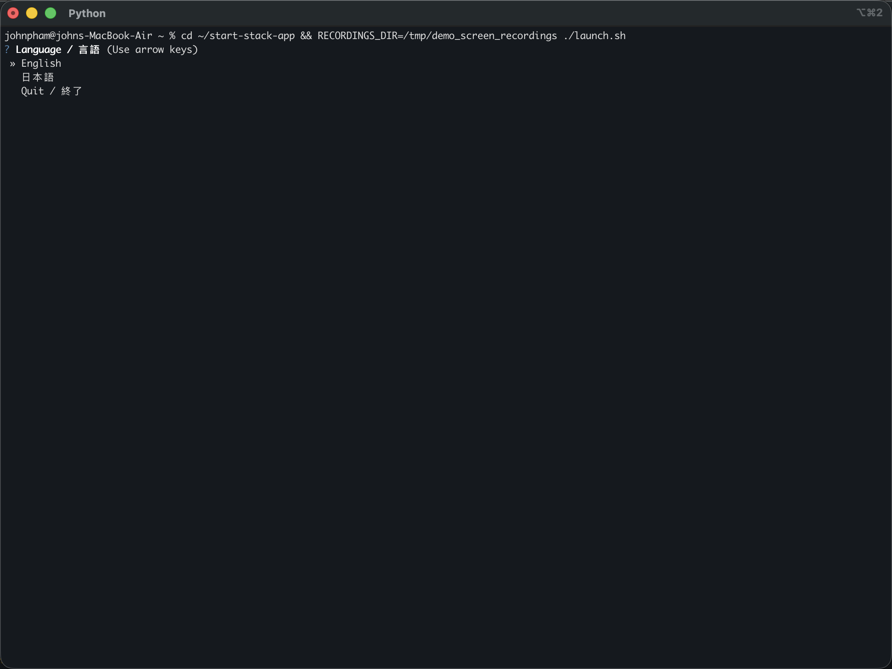
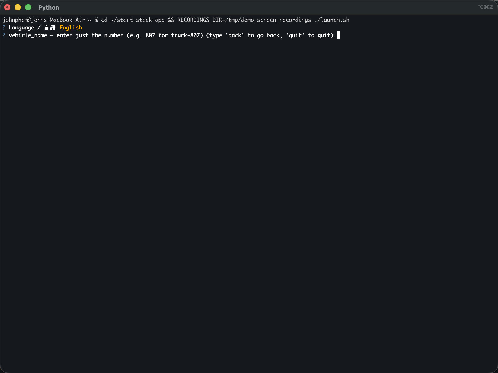
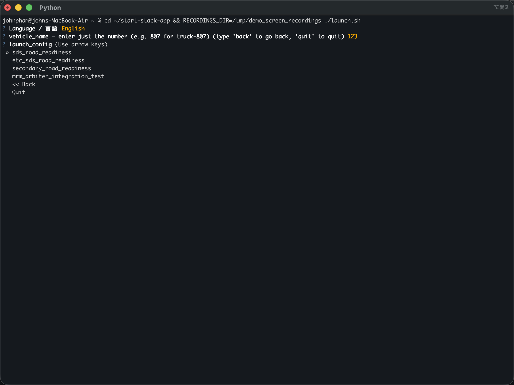
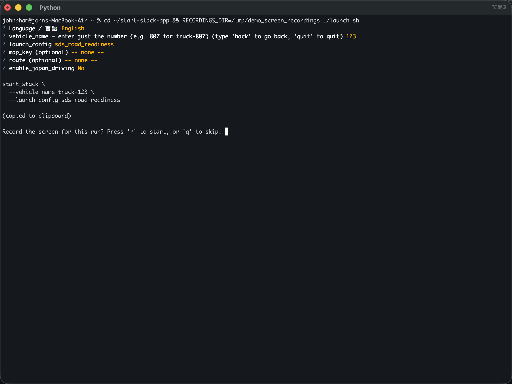
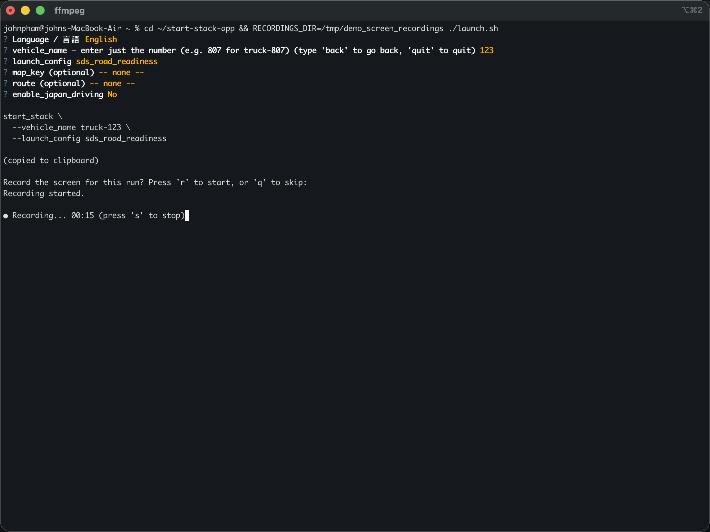
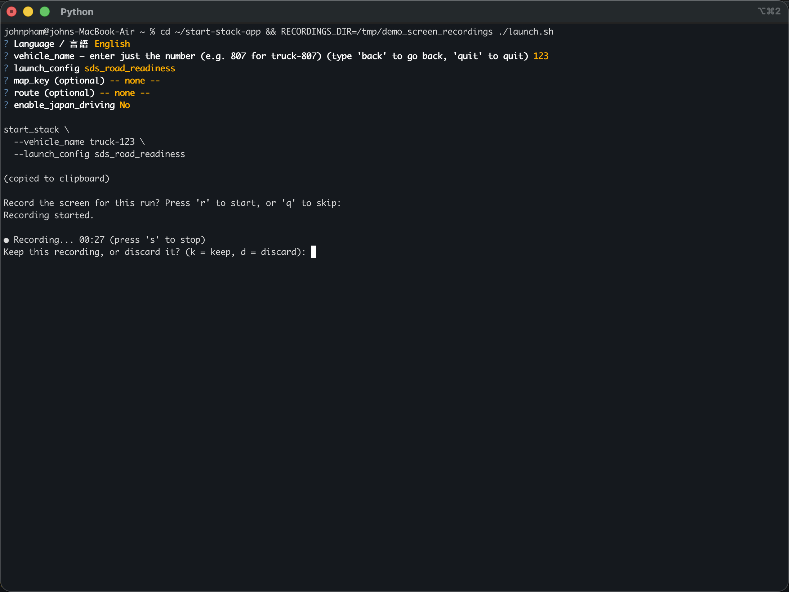
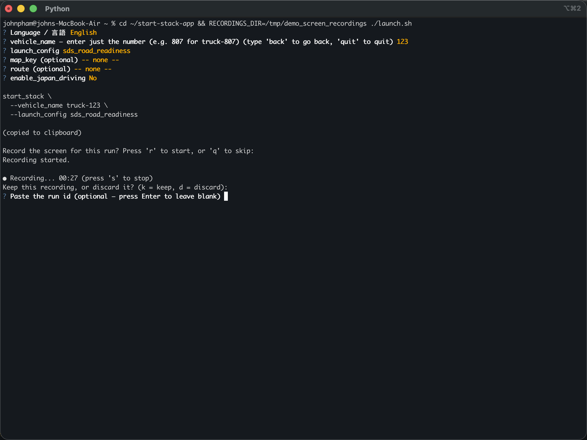
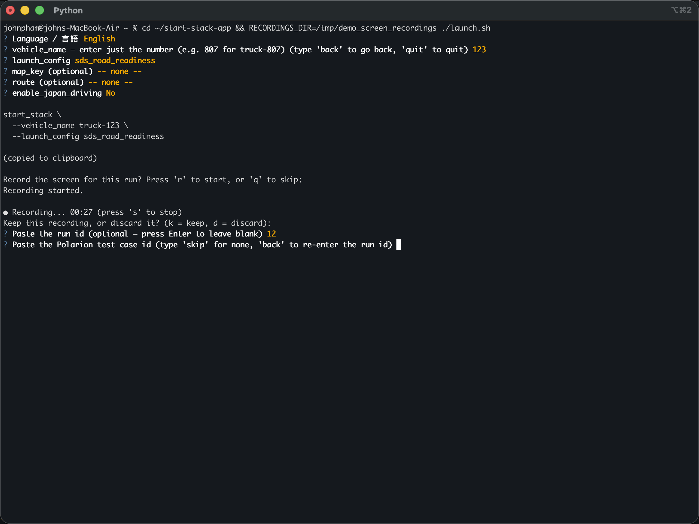
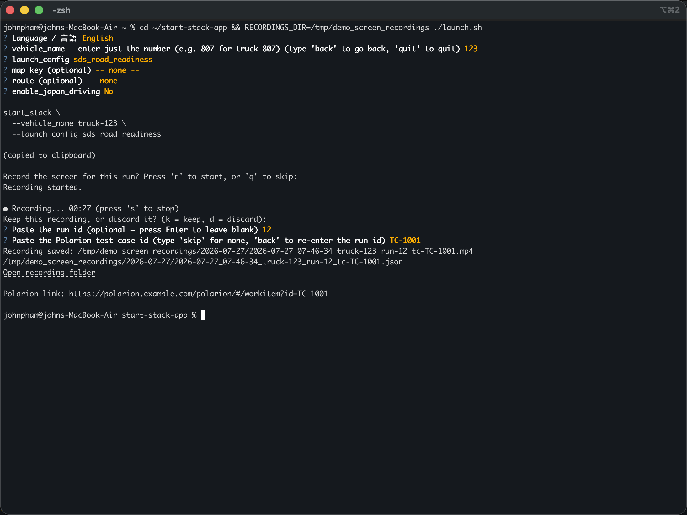
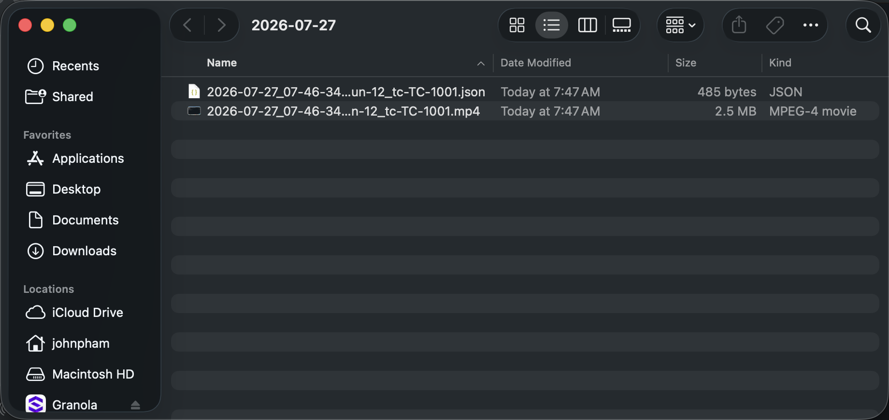

# Getting Started (No Coding Required)

*This guide assumes you've never used a terminal before. If you're comfortable with the command line already, the [README](README.md) covers the same tool in more technical detail.*

## What is this?

This tool does two things for you:

1. **Builds the `start_stack` launch command** by asking you simple questions (pick from a list, type a number) instead of you having to remember a long line of technical flags.
2. **Records your screen while you test**, automatically saves the recording in a folder named for today's date, and can tag it with a Polarion test case id so you know exactly which test it belongs to.

You don't need to know how to code to use it — just follow the prompts.

## One-time setup

You only need to do this once, ever.

1. Open a terminal window. On a Mac, press **Cmd + Space**, type **Terminal**, and press **Enter**. (If your team uses iTerm2 instead, search for that.)
2. Type the following exactly, then press **Enter**:

   ```
   cd ~/start-stack-app && ./launch.sh
   ```

3. The first time this runs, it quietly sets itself up and adds a shortcut called `launch`. Close the terminal window and open a new one afterward so that shortcut is ready to use.

## Everyday use

From now on, whenever you want to use the tool:

1. Open a terminal window (Cmd + Space, type **Terminal**, press Enter).
2. Type `launch` and press **Enter**.

That's it — no need to remember the folder or the setup command again.

## Walking through the questions

Everything is a question, one at a time. Use the **arrow keys** to move up and down a list, and press **Enter** to confirm your answer. If you change your mind, most screens let you pick **`<< Back`** to go to the previous question.

**1. Language** — pick English or 日本語:



**2. Vehicle number** — start typing the number (e.g. `123` for truck-123) and matching suggestions pop up as you type. You can also arrow down through them instead of typing:



**3. Launch config** — pick one from the list with the arrow keys:



A couple more quick questions follow the same pattern (the route — organized by map, just pick one or choose `-- none --` — and whether to enable Japan driving mode) — pick an answer and press Enter each time.

*Right after the language one, a menu asks **"What do you want to do?"** — **Build a new command** is the usual path (pick it to answer the questions below). **Record the screen only** skips the questions and goes straight to the recording flow described later, and once you've saved presets or built commands before, those appear here too for one-step rebuilds.*

**5. Your command is ready:**



The finished command is shown on screen **and copied to your clipboard automatically** — meaning you can paste it (Cmd + V) wherever you actually need to run it, without retyping anything.

You may also be asked **"Save these choices as a preset?"** — answer Yes, give it a name, and next time you can rebuild that exact command in one step from the shortcut question mentioned above. Answer No (or just press Enter) to skip it.

## Recording your screen

Right after your command is ready, you're asked whether to record the screen for this run (see the last line in the screenshot above). This is entirely optional and controlled with single key presses — no need to press Enter for these. The tool picks the right recording program for your machine automatically (and installs it if it's missing — on a Mac that's `ffmpeg` via Homebrew; on Linux it varies by desktop).

- Press **`r`** to start recording, or **`q`** to skip it.

Once you press `r`, recording starts immediately and you'll see a live counter so you know it's really running:



Go do whatever you're testing, then come back to the terminal and:

- Press **`s`** to stop recording.

You'll then be asked whether to keep it:



- Press **`k`** to keep the recording, or **`d`** to throw it away immediately (useful if the take didn't come out right — nothing is saved, no more questions asked).

If you keep it, you're asked two quick questions to label it:



**Run id** — paste or type any identifier you use to track this specific run. This is optional; just press Enter to leave it blank.



**Polarion test case id** — if this recording is for a specific Polarion test case, type its id here. If not, type `skip` (or just press Enter). If you skip it once, the tool remembers that and defaults to skipping next time too, so you're not asked to re-decline every single time.

## Finding your recording afterward

Once you're done, you'll see exactly where everything was saved:



The **"Open recording folder"** text is a clickable link — click it and it opens straight to the right folder in Finder, showing your video alongside a small info file (which holds the Polarion link, the run id, and other details):



Recordings are organized automatically into a folder named for today's date, so you'll always know when a recording was made just by looking at the folder it's in.

## A permission popup the first time you record

The very first time you ever record your screen on a given computer, macOS will interrupt with a system popup asking whether your terminal app is allowed to record the screen. Click **Allow** (or **Open System Settings** and turn on the switch next to your terminal app). If you accidentally click Deny, or the popup never appeared, go to  **System Settings → Privacy & Security → Screen Recording** and turn the switch on for your terminal app, then quit and reopen the terminal.

On Linux, the first recording may show a similar screen-sharing approval popup — approve it and the recording starts. If nothing is installed to record with, the tool either installs it for you automatically or tells you exactly what to install.

## Frequently asked questions

**I made a mistake on an earlier question — do I have to start over?**
No — most questions offer a **`<< Back`** option in the list, or (for typed answers) you can type `back`.

**What's a preset?**
A saved set of answers (vehicle, config, map, route, and the Japan driving toggle) under a name you choose. When a new truck or route is what you build every morning, save it once and rebuild it with two key presses after that.

**I don't have a Polarion test case id yet — is that okay?**
Yes, just type `skip` or press Enter past that question. Nothing about the recording depends on having one.

**Where exactly do my recordings get saved?**
In your home folder, under `screen_recordings`, inside a folder named for today's date (e.g. `screen_recordings/2026-07-27/`).

**I pressed `r` or `s` and nothing happened.**
Make sure the terminal window is the active (highlighted) window — click into it once, then try the key again.

**Who do I ask if I'm stuck?**
Whoever shared this tool or folder with you.
